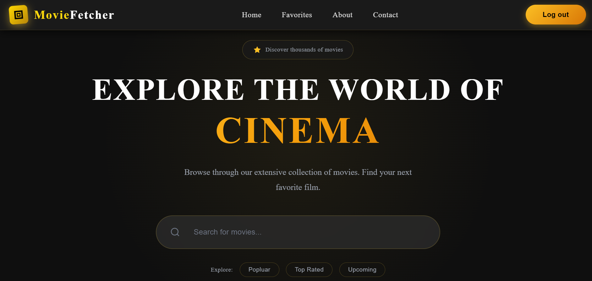
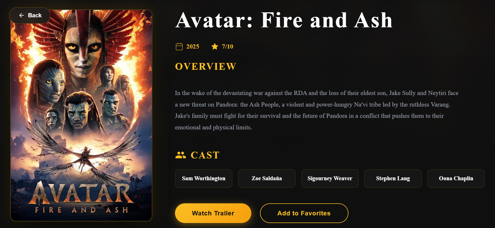
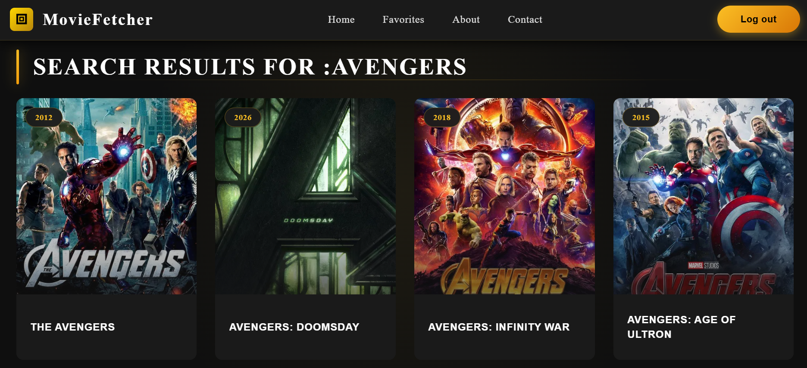
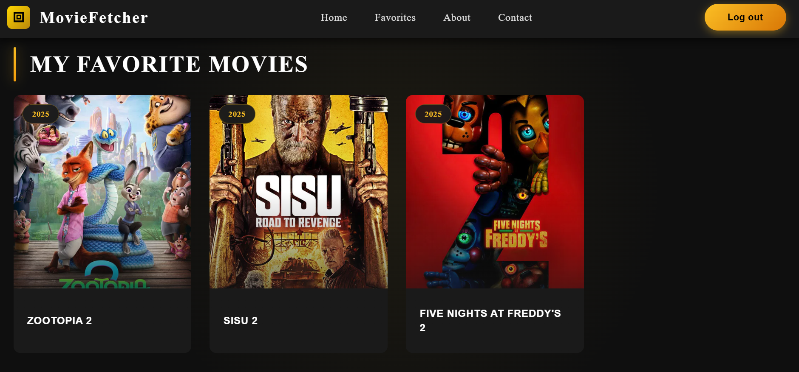
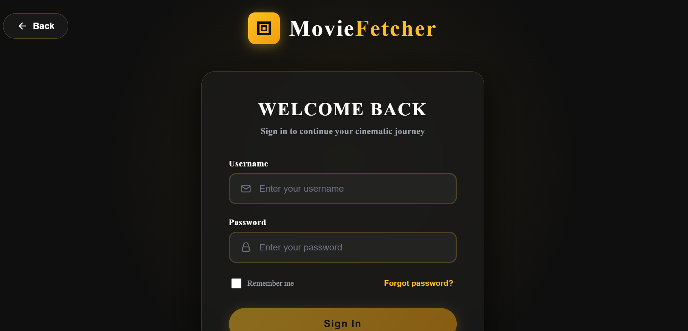
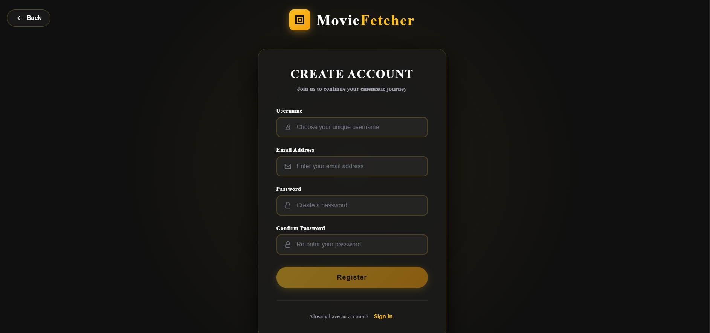

<p align="center">
  
</p>

# 🎥 FilmFetcher

A modern, full-stack movie discovery and management application built with **Spring Boot 3** and **Angular 19**. FilmFetcher provides a seamless experience for browsing trending movies and maintaining a personalized "favorites" list, secured by **Auth0** enterprise-grade authentication.

---

## 🚀 Key Features

- **Enterprise Authentication:** Managed login and registration flows powered by **Auth0**.
- **Secure Identity:** Uses OAuth2 and OpenID Connect (OIDC) standards for user identity.
- **Movie Discovery:** Real-time data fetching from TMDB for trending and top-rated films.
- **Personalized Favorites:** Toggle movies in/out of your collection with instant UI feedback.
- **Modern Control Flow:** Utilizes Angular 19's `@if` and `@for` for high-performance rendering.
- **Robust API Security:** Spring Boot backend validates Auth0-issued JWTs to protect user data.
- **Professional Notifications:** Integrated **SweetAlert2** for toasts and interactive alerts.

---

## 📸 Application Gallery

### User Experience & Discovery
| Movie Details | Search Results |
|:---:|:---:|
|  |  |

### Personal Collection
| My Favorites List |
|:---:|
|  |

### Authentication (via Auth0)
| Sign In | Sign Up |
|:---:|:---:|
|  |  |

---

## 🛠️ Tech Stack

### Frontend
- **Framework:** Angular 19 (Standalone Components)
- **Identity Provider:** Auth0 SDK for Angular
- **State Management:** RxJS (Observables & `forkJoin`)
- **Feedback:** SweetAlert2

### Backend
- **Framework:** Spring Boot 3.x (Java 21)
- **Data Access:** Spring Data JPA (Hibernate)
- **Architecture:** DTO Pattern using **Java Records**

---

## 🔐 Authentication Flow

1. **Frontend:** User clicks "Login" and is redirected to the Auth0 Universal Login page.
2. **Auth0:** After successful login, Auth0 redirects the user back to the Angular app with an **Access Token**.
3. **API Calls:** Angular attaches this token to the `Authorization` header.
4. **Backend:** Spring Boot validates the token using Auth0 public keys.

---

## 📂 Project Structure

### Backend Architecture
- **Controllers:** REST endpoints protected by Auth0 scope checks.
- **Security Config:** Configured as an **OAuth2 Resource Server** to validate JWTs.
- **Entities:** JPA models for `UserEntity` and `FavoriteMovie`.
- **DTOs:** Immutable Java Records for clean data transfer.
- **Exceptions:** GlobalExceptionHandler for mapping custom domain exceptions.

---

## ⚙️ Setup & Installation

### 1. Prerequisites
- **Java 21** or higher
- **Node.js** (LTS version)
- **Auth0 Account:** SPA for Angular and API for Spring Boot.
- **TMDB API Key** (Free from [themoviedb.org](https://www.themoviedb.org/))

### 2. Backend Configuration
Create or edit your `src/main/resources/application.properties`:

```properties
api.url=[https://api.themoviedb.org/3/](https://api.themoviedb.org/3/)
api.key=YOUR_TMDB_API_KEY

jwt.key=YOUR_GENERATED_SECRET_KEY
jwt.expiration=86400
